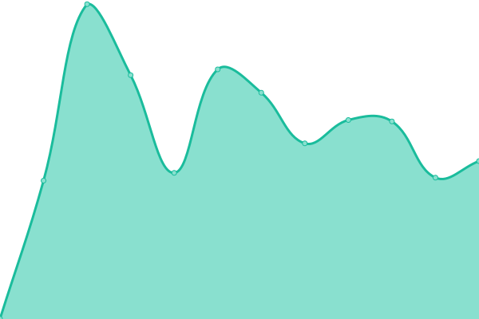

# [📈 Live Status](https://demo.upptime.js.org): <!--live status--> **🟩 All systems operational**

This repository contains the open-source uptime monitor and status page for [LeverUp](https://leverup.xyz), powered by [Upptime](https://github.com/upptime/upptime).

With [Upptime](https://upptime.js.org), you can get your own unlimited and free uptime monitor and status page, powered entirely by a GitHub repository. We use [Issues](https://github.com/leverup-xyz/status-pages/issues) as incident reports, [Actions](https://github.com/leverup-xyz/status-pages/actions) as uptime monitors, and [Pages](https://demo.upptime.js.org) for the status page.

<!--start: status pages-->
<!-- This summary is generated by Upptime (https://github.com/upptime/upptime) -->
<!-- Do not edit this manually, your changes will be overwritten -->
<!-- prettier-ignore -->
| URL | Status | History | Response Time | Uptime |
| --- | ------ | ------- | ------------- | ------ |
|  [LeverUp Service](https://service.leverup.xyz/sys/health) | 🟩 Up | [lever-up-service.yml](https://github.com/leverup-xyz/status-pages/commits/HEAD/history/lever-up-service.yml) | 

 184ms
     
 | 

<a href="https://https://leverup-xyz.github.io/history/lever-up-service">100.00%</a>
    

|  [LeverUp OneClick service](https://oneclick-01-keeper.leverup.xyz/sys/health) | 🟩 Up | [lever-up-one-click-service.yml](https://github.com/leverup-xyz/status-pages/commits/HEAD/history/lever-up-one-click-service.yml) | 

 197ms
     
 | 

<a href="https://https://leverup-xyz.github.io/history/lever-up-one-click-service">100.00%</a>
    

|  [Keeper Balance](https://leverup-status-pages.vercel.app/api/check-balance) | 🟩 Up | [keeper-balance.yml](https://github.com/leverup-xyz/status-pages/commits/HEAD/history/keeper-balance.yml) | 

 654ms
     
 | 

<a href="https://https://leverup-xyz.github.io/history/keeper-balance">100.00%</a>
    

<!--end: status pages-->

[**Visit our status website →**](https://demo.upptime.js.org)

## 📄 License

- Powered by: [Upptime](https://github.com/upptime/upptime)
- Code: [MIT](./LICENSE) © [Anand Chowdhary](https://anandchowdhary.com), supported by [Pabio](https://pabio.com)
- Data in the `./history` directory: [Open Database License](https://opendatacommons.org/licenses/odbl/1-0/)
